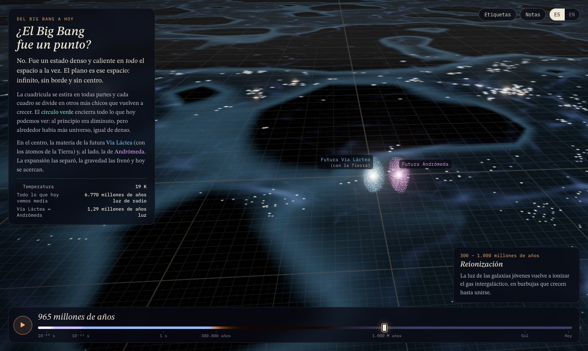

# ¿El Big Bang fue un punto? · Was the Big Bang a point?



**🌐 [bigbango.vercel.app](https://bigbango.vercel.app)** · English: [bigbango.vercel.app/?lang=en](https://bigbango.vercel.app/?lang=en)

[Español](#español) · [English](#english)

---

## Español

Una animación interactiva en 3D (three.js) que responde una pregunta: **¿el Big Bang fue una explosión en un punto, o un estado denso y caliente en todas partes a la vez?** También muestra dónde estaba la materia que hoy forma la Vía Láctea (y la Tierra) y la de Andrómeda.

### Qué muestra

- **El espacio es un plano infinito.** Tiene una cuadrícula que se estira todo el tiempo: cada cuadro se divide en otros más chicos que vuelven a crecer. Así la expansión se ve continua desde 10⁻⁴⁴ s hasta hoy, con el "estirón" de la inflación incluido.
- **Un círculo verde encierra todo lo que hoy podemos ver.** Al principio era diminuto (unos 9 años luz al primer segundo), pero alrededor había más universo, igual de denso: nunca hubo un borde ni un "afuera".
- **La Vía Láctea y Andrómeda empiezan juntas.** Al primer segundo su materia estaba a unos 110 UA. La expansión las separa, la gravedad las frena, y hoy se acercan.
- **La red cósmica y las galaxias** crecen desde las fluctuaciones del plasma primordial.
- **Un recuadro explica brevemente cada época**, desde la era de Planck hasta hoy.
- **Tres datos en vivo:** la temperatura, el tamaño de todo lo que hoy vemos y la distancia Vía Láctea ↔ Andrómeda.
- **Es bilingüe:** español por defecto e inglés, con el botón `ES | EN` o con `?lang=en`.
- **Capa "Fondo cósmico" (botón arriba a la derecha).** Muestra la luz liberada a los 380.000 años que todavía nos llega: nace a 41 millones de años luz, se aleja hasta 5.850 millones de años luz porque el espacio se estira más rápido de lo que ella avanza, y recién después vuelve y llega hoy. Detrás siempre viene más luz, desde más lejos. Una regla del espectro muestra cómo su onda se estira de ~1 µm a ~1 mm (microondas).

### Cómo verlo localmente

Es un solo archivo, `index.html`, y no necesita instalación ni paso de build. Carga three.js y las fuentes desde CDN, así que necesita conexión a internet.

```bash
python3 -m http.server 8000
# abrir http://localhost:8000
```

También se puede abrir `index.html` con doble clic. Si el navegador bloquea los módulos por ser `file://`, usá el servidor de arriba.

### Cómo está hecho

- **Cosmología:** modelo ΛCDM plano con parámetros de Planck 2018 (H₀ = 67,4 km/s/Mpc, Ωm = 0,315). La relación tiempo ↔ factor de escala *a(t)* se integra numéricamente al cargar la página, incluyendo los grados de libertad relativistas *g\*(T)*. Tiempos, temperaturas, densidades y distancias salen de ese modelo.
- **Cámara:** muestra distancias reales y fijas. La cuadrícula es jerárquica (cada nivel mide el doble que el anterior) y su escala se reduce módulo 2 en el shader, para que la expansión se vea a cualquier escala sin perder precisión numérica.
- **Plasma primordial:** ruido autosemejante, porque las fluctuaciones reales son casi iguales a toda escala. Está exagerado unas 10⁴ veces.
- **Red cósmica:** aproximación de Zel'dovich sobre un campo gaussiano 2D, calculada con FFT en el navegador.
- **Vía Láctea y Andrómeda:** colapso esférico por cascarones hacia halos NFW, gas que se asienta en discos y órbita según el "argumento de tiempo" (Kahn y Woltjer, 1959). Formas y orientaciones son ilustrativas.
- **Antes de 10⁻³² s la imagen es simbólica:** la inflación es una hipótesis y la era de Planck, física desconocida.

### Publicación

```bash
npx vercel deploy --prod
```

### Fuentes

- Planck Collaboration (2020), *A&A* 641, A6 — [arXiv:1807.06209](https://arxiv.org/abs/1807.06209)
- Davis y Lineweaver (2004), *Expanding confusion* — [arXiv:astro-ph/0310808](https://arxiv.org/abs/astro-ph/0310808)
- Kahn y Woltjer (1959), *ApJ* 130, 705
- van der Marel et al. (2012), *ApJ* 753, 8 — [arXiv:1205.6864](https://arxiv.org/abs/1205.6864)
- Sawala et al. (2025), *Nature Astronomy* — [doi:10.1038/s41550-025-02563-1](https://www.nature.com/articles/s41550-025-02563-1)
- Vardanyan, Trotta y Silk (2011), *MNRAS* 413, L91 — [arXiv:1101.5476](https://arxiv.org/abs/1101.5476)
- Zel'dovich (1970), *A&A* 5, 84

---

## English

An interactive 3D animation (three.js) that answers one question: **was the Big Bang an explosion from a point, or a hot, dense state everywhere at once?** It also shows where the matter that forms the Milky Way today (and Earth) was, and where Andromeda's was.

### What it shows

- **Space is an infinite plane.** It has a grid that keeps stretching: every square splits into smaller ones that grow again. The expansion looks continuous from 10⁻⁴⁴ s to today, including the burst of inflation.
- **A green circle encloses everything we can see today.** At first it was tiny (about 9 light-years one second after the Big Bang), but there was more universe around it, just as dense: there was never an edge or an "outside".
- **The Milky Way and Andromeda start together.** One second after the Big Bang their matter was about 110 AU apart. The expansion pulls them apart, gravity slows them down, and today they are approaching each other.
- **The cosmic web and galaxies** grow out of the fluctuations in the primordial plasma.
- **A small box briefly explains each epoch**, from the Planck era to today.
- **Three live readouts:** the temperature, the size of everything we see today, and the Milky Way ↔ Andromeda distance.
- **It is bilingual:** Spanish by default and English, via the `ES | EN` toggle or `?lang=en`.
- **"Cosmic background" layer (button at the top right).** It shows the light released at 380,000 years that still reaches us: it starts 41 million light-years away, recedes to 5.85 billion light-years because space stretches faster than it advances, and only then turns back and arrives today. More light keeps coming behind it, from farther away. A spectrum ruler shows its wave stretching from ~1 µm to ~1 mm (microwaves).

### Run it locally

It is a single file, `index.html`, with no install and no build step. It loads three.js and fonts from a CDN, so it needs an internet connection.

```bash
python3 -m http.server 8000
# open http://localhost:8000
```

You can also double-click `index.html`. If the browser blocks modules on `file://`, use the server above.

### How it works

- **Cosmology:** flat ΛCDM with Planck 2018 parameters (H₀ = 67.4 km/s/Mpc, Ωm = 0.315). The time ↔ scale factor *a(t)* relation is integrated numerically at load time, including the relativistic degrees of freedom *g\*(T)*. Times, temperatures, densities and distances all come from that model.
- **Camera:** shows real, fixed distances. The grid is hierarchical (each level is twice the size of the previous one) and its scale is reduced modulo 2 in the shader, so the expansion is visible at every scale without losing numerical precision.
- **Primordial plasma:** self-similar noise, because the real fluctuations are nearly scale-invariant. It is exaggerated about 10⁴ times.
- **Cosmic web:** Zel'dovich approximation on a 2D Gaussian field, computed with an FFT in the browser.
- **Milky Way and Andromeda:** shell-by-shell spherical collapse into NFW halos, gas settling into disks, and an orbit from the "timing argument" (Kahn & Woltjer, 1959). Shapes and orientations are illustrative.
- **Before 10⁻³² s the picture is symbolic:** inflation is a hypothesis and the Planck era is unknown physics.

### Deploy

```bash
npx vercel deploy --prod
```

### Sources

See the list in the [Spanish section](#fuentes); the references are the same.
